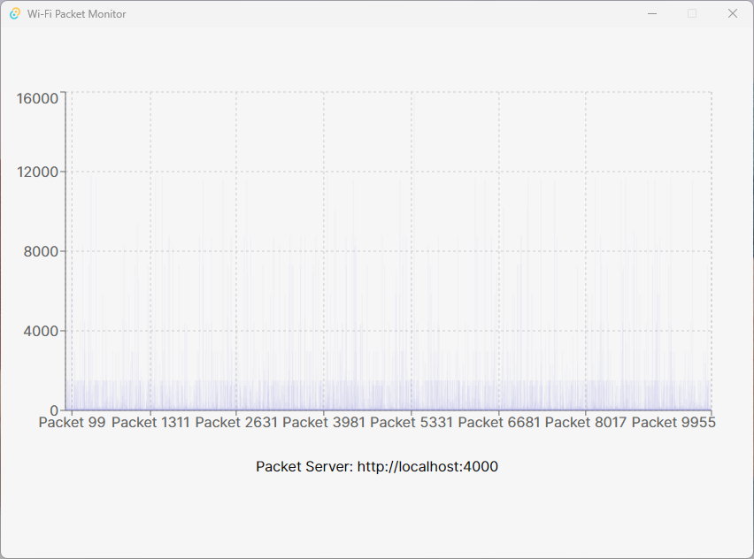
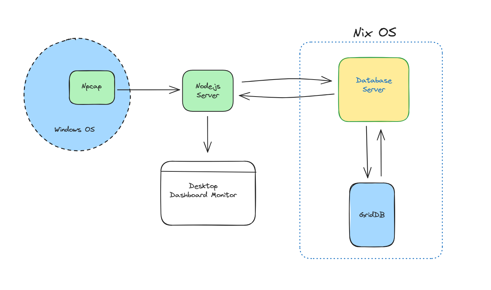
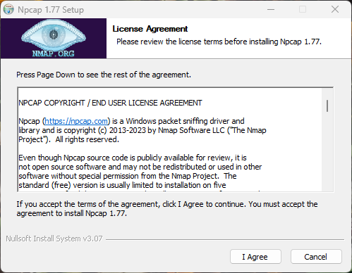

# Building a Desktop WiFi Network Monitor with Tauri, React, Node.js, and GridDB

## Introduction

In this article, we will delve into the process of constructing a Desktop WiFi Network Monitor, intricately weaving together technologies like **Node.js**, **Tauri**, and **React**. Central to our architectural decisions is the emphasis on using **GridDB** for our storage needs. But why GridDB? As we navigate through the intricacies of WiFi network monitoring, the choice of a reliable and efficient storage mechanism becomes paramount. GridDB, with its unique features and optimized performance characteristics, emerges as an ideal candidate. Paired with the versatility of Node.js, the rich user interface capabilities of React, and the cross-platform advantages of Tauri, we aim to present a holistic approach to effective network monitoring.

## Soure Code

There are a few steps to setup the project:

### Preparation

This source code tested on Windows 11 with Ubuntu 20.04 on WSL2 and heavily depends on the native packet capture which is **Npcap** on Windows. First install it, look at this [section](#capture-network-traffic) for more information.

### Clone the Source Code on Windows

Clone the source code from this [GitHub repository](https://github.com/junwatu/bearsakura-netwatch). There will be two server running on different operating system. The first one is the **Node.js** server that act like a forwader that will run on Windows and the second one is the **Node.js** server that connect to **GridDB** that will run on Linux. The **Node.js Forwarder** will capture the WiFi network traffic and send it to the **Node.js** server on Linux. The **Node.js** server on Linux will store the captured packets into the database and also serve the data to the **Tauri** desktop application.

**Node.js Forwarder**

```shell

```shell
git clone git@github.com:junwatu/bearsakura-netwatch.git
```
Go to the `server` directory and install all the dependencies

```shell
cd server
npm install
```

### Configure `env`

Configure the `.env` file to meet your IP address and change the port if you have to. These are the default values:

```ini
# This is the port of the server that is running the packet forwarder
PACKET_PORT=5000

# This is the port of the server that is running the database
DATABASE_SERVER_PORT=4000
```

- `PACKET_PORT` is where the port of this server listen to. Change this if you have to.
- `DATABASE_SERVER_PORT=4000` is where the port of the database server listen to.

### Run the forwarder

This command will run the server:

```shell
npm run dev
```

### Clone the Source Code on Linux

Clone the source code from this [GitHub repository](https://github.com/junwatu/bearsakura-netwatch). Go to the `server-db` directory and install all the dependencies.

```shell
cd server-db
npm install
```

### Configure `env` for the server on Linux

Configure the `.env` file and change the port if you have to. These are the default values:

```ini
DATABASE_SERVER_PORT=4000
```

Make sure this port is match with the `.env` configuration on the **Node.js Forwarder**. For example, if the `.env` configuration is `DATABASE_SERVER_PORT=3000` this port should be `3000` too.

### Run the server on Linux

This command will run the server:

```shell
npm run dev
```

### Run the desktop monitor

Download the desktop binary file from [here](https://github.com/junwatu/bearsakura-netwatch/releases/download/v0.1.0/BearWatch_0.1.0_x64-setup.exe). Run the installer and go to the installation directory.

Open the `config.json` file:

```json
{
    "api": {
        "base_url": "http://localhost:4000"
    }
}
```

Make sure the `base_url` port is match with the `.env` configuration `DATABASE_SERVER_PORT=4000`. For example, if the `.env` configuration have `DATABASE_SERVER_PORT=3000` then the `base_url` should be `http://localhost:3000`.

Run the desktop application:



## System Architecture



Within the architecture of the Desktop WiFi Network Monitor, **Npcap** stands out as a powerful packet capture module optimized for Windows OS. This utility continuously fetches WiFi network packets, subsequently channeling them to our dedicated **Node.js Forwarder**. This forwarder will then send the packets to the **Node.js Server** that will store the data into the **GridDB** database. The **Node.js Server** will also serve the data to the **Desktop Database Monitor** that will display the data into a desktop dashboard.

## Capture Network Traffic

Capturing network traffic using Node.js typically involves native modules that interface with system-level libraries like **libpcap** (on Unix-like systems) or **WinPcap/Npcap** (on Windows). For this post, we will be using Windows OS.

### Install Npcap

[Npcap](https://npcap.com/) is a packet capture and sending library for Microsoft Windows. We need to install this software first so that later we can use it with the node.js npm package, such as [`cap`](https://github.com/mscdex/cap), to perform packet capturing.

To download Npcap, please visit [their site](https://npcap.com/#download) and choose the appropriate installer type for a hassle-free installation. Upon installation, leave every option at its default.



## Backend Development with Node.js and GridDB

### Node.js

Node.js® is an open-source, cross-platform JavaScript runtime environment. Download the Windows installer from [here](https://nodejs.org/en/download). We will use the Node.js LTS v18.18.0 version. There many ways to install Node.js in Windows, please look into their [documentation](https://nodejs.dev/en/). We can use 3rd party Windows package installer such as [chocolatey](https://chocolatey.org/) or use the manual installation.

You can check the Node.js installation in the terminal with running this command:

```shell
node --version
```

### GridDB

GridDB is a highly scalable NoSQL database specifically tailored for time-series data. Rooted in its unique architecture, it offers both in-memory and disk-based storage, ensuring optimized performance and data durability. Its architecture is designed to handle massive volumes of data, making it a preferred choice for IoT, telemetry, and any application where time-based data is crucial. Beyond its core features, GridDB boasts advanced functions like automatic partitioning and robust failover mechanisms, ensuring data consistency and high availability.

Go to the [Official GridDB website](https://docs.griddb.net) for installation information.

### Packet Capture with Node.js

The code for packet capture is pretty easy. The `startCapturing(ipAddress)` function will start the packet capturing process. It will detect the WiFi interface and start capturing the packets. The `getPackets()` function will return the captured packets.

```js
import pkg from 'cap';
const { Cap, decoders } = pkg;

const PROTOCOL = decoders.PROTOCOL;

let packets = [];

function startCapturing(ipAddress) {
	const c = new Cap();
	const device = Cap.findDevice(ipAddress);
	const filter = 'ip';
	const bufSize = 10 * 1024 * 1024;
	const buffer = Buffer.alloc(65535);

	const devices = Cap.deviceList();
	const wifiDevice = devices.find(device => {
		const description = device.description.toLowerCase();
		return description.includes('wireless') || description.includes('wi-fi');
	});

	if (!wifiDevice) {
		console.error('No Wi-Fi device found!');
		process.exit(1);
	}

	const wifiInterfaceName = wifiDevice.name;
	const linkType = c.open(wifiInterfaceName, filter, bufSize, buffer);

	c.on('packet', function(nbytes, trunc) {
		const ret = decoders.Ethernet(buffer);

		if (ret.info.type === 2048) {
			const decodedIP = decoders.IPV4(buffer, ret.offset);
			const srcaddr = decodedIP.info.srcaddr;
			const dstaddr = decodedIP.info.dstaddr;

			let packetInfo = {
				length: nbytes,
				srcaddr: srcaddr,
				dstaddr: dstaddr
			};

			if (decodedIP.info.protocol === PROTOCOL.IP.TCP) {
				const decodedTCP = decoders.TCP(buffer, decodedIP.offset);
				packetInfo.protocol = 'TCP';
				packetInfo.srcport = decodedTCP.info.srcport;
				packetInfo.dstport = decodedTCP.info.dstport;
			} else if (decodedIP.info.protocol === PROTOCOL.IP.UDP) {
				const decodedUDP = decoders.UDP(buffer, decodedIP.offset);
				packetInfo.protocol = 'UDP';
				packetInfo.srcport = decodedUDP.info.srcport;
				packetInfo.dstport = decodedUDP.info.dstport;
			}

			packets.push(packetInfo);

			// Limit the storage to the last 100 entries (or any other number)
			if (packets.length > 100) packets.shift();
		}
	});
}

function getPackets() {
	return packets;
}

export { startCapturing, getPackets };
```

This packets is hosted on `http://localhost:5000/packets` (the port and host depends on the `.env` configuration settings). The server act like a forwarder. It run on Express.js and use the `startCapturing` module to get the captured packets.

```js

import 'dotenv/config';
import express from 'express';
import bodyParser from 'body-parser';
import axios from 'axios';
import * as packetCapturer from './packetCapturer.js';

const app = express();
app.use(bodyParser.json());

const PORT = process.env.PACKET_PORT || 3000;
const HOST = process.env.PACKET_IP_ADDRESS || 'localhost';
const SERVER_DB_HOST = process.env.DATABASE_SERVER || 'localhost';
const SERVER_DB_PORT = process.env.DATABASE_SERVER_PORT || 4000;

packetCapturer.startCapturing(process.env.PACKET_IP_ADDRESS);

setInterval(async () => {
	const packets = packetCapturer.getPackets();
	try {
		await axios.post(`http://${SERVER_DB_HOST}:${SERVER_DB_PORT}/save-packets`, packets);
		console.log('Packets sent successfully');
	} catch (error) {
		console.error('Error sending packets:', error);
	}
}, 5000);  // Adjust the interval to your needs


app.get('/packets', (req, res) => {
	res.json(packetCapturer.getPackets());
});

app.listen(PORT, HOST, () => {
	console.log(`Server started on http://${HOST}:${PORT}`);
});
```

This forwarder will send packets to Node.js server on Linux every 5 seconds. 

### Node.js Server

The Node.js server is a simple Node.js server that running on Linuc and will receive the captured packets and store them into the GridDB database. The database server will run on `http://localhost:4000` (the port depends on the `.env` configuration settings). 

```js
// create express app
import 'dotenv/config';
import cors from 'cors';
import express from 'express';
import bodyParser from 'body-parser';
import* as griddb from './griddbservice.js'

    const app = express();
app.use(cors());
app.use(bodyParser.json());

const PORT = process.env.DATABASE_SERVER_PORT || 4000;
const HOST = process.env.DATABASE_SERVER || 'localhost';

app.get(
    '/info', (req, res) = > { res.json({message : 'database server'}); });

app.post(
    '/save-packets', async(req, res) = > {
      const packets = req.body;

      for (let packet of packets) {
        const {length, srcaddr, dstaddr, protocol, srcport, dstport} = packet;
        await griddb.saveData(
            {length, srcaddr, dstaddr, protocol, srcport, dstport});
      }

      res.json({message : 'saved'});
    });

app.get('/get-all-packets', async (req, res) => {
  const packets = await griddb.getAllData();
  res.json({packets});
})

app.listen(PORT, HOST, () => {
	console.log(`Server started on http://${HOST}:${PORT}`);
});
```
## Frontend Development with Tauri and React

### Tauri

[Tauri](https://tauri.studio/) is a toolkit for building small, secure, and fast applications with web technologies. It's a competitor to [Electron](https://www.electronjs.org/), aiming to provide a leaner and more performant solution for creating desktop applications with web front-ends. The core idea is to enable developers to use familiar web technologies while reducing the bloat and potential security issues associated with bundling a complete Chromium instance, which is what Electron does.

Tauri is built in [Rust](https://www.rust-lang.org/), a memory-safe language, and its core is a very lightweight webview rendering engine. This allows for significantly smaller binary sizes and lower resource usage compared to Electron. It also provides a strong security model by minimizing the necessary permissions and isolating the web content from the system.

The motivation behind Tauri's creation was to address the common criticisms of Electron regarding size, speed, and security, while preserving the ease of development and cross-platform capabilities that web technologies provide.

### React

[React](https://react.dev/) is a JavaScript library for building user interfaces, maintained by Facebook and a community of individual developers and companies. It was created to facilitate the development of complex, interactive UIs in an efficient and flexible manner. React's [virtual DOM](https://reactjs.org/docs/faq-internals.html) further optimizes rendering and improves app performance. The declarative nature of React simplifies the code, making it easier to debug and manage. The component-based architecture allows developers to build encapsulated components that manage their own state, which can then be composed to make complex UIs. React also empowers developers with the ability to create web applications that can update and render efficiently in response to data changes.

### Tauri and React

The code for the Tauri and React live in `desktop` folder. To build it you need to install rust and node.js. Please follow the [Tauri installation guide](https://tauri.app/v1/guides/getting-started/prerequisites) for more information.


The main UI for desktop wifi monitor is:

```js
import React, { useState, useEffect } from 'react'
import PacketVisualization from './packet-visualization'
import { invoke } from "@tauri-apps/api/tauri";
import "./App.css";

function App() {
  const [packetData, setPacketData] = useState(null)
  const [apiBaseUrl, setApiBaseUrl] = useState(null)
  useEffect(() => {
    async function fetchPacketData() {
      const config = await invoke('read_config');
      const apiBaseUrlConfig = await invoke('get_api_base_url', { config: config });
      const response = await fetch(`${apiBaseUrlConfig}/get-all-packets`)
      const data = await response.json()

      setPacketData(data)
      setApiBaseUrl(apiBaseUrlConfig)
    }
  
    fetchPacketData()
    
	// fetch every 5 seconds
    const intervalId = setInterval(fetchPacketData, 5000)  
    // cleanup interval on component unmount
    return () => clearInterval(intervalId)  
  }, [])
  

  return (
    <div className="container">
      {packetData && <PacketVisualization data={packetData} />}
      <p className='packet-server'>
        Packet Server: {apiBaseUrl}
      </p>
    </div>
  );
}

export default App;
```

This code invoke rust code that read our `config.json` configuration.

```js
const config = await invoke('read_config');
const apiBaseUrlConfig = await invoke('get_api_base_url', { config: config });
const response = await fetch(`${apiBaseUrlConfig}/get-all-packets`)
```

The JavaScript code will call the rust code that read the `config.json` file and get the `apiBaseUrl` configuration. The `apiBaseUrl` configuration is the `base_url` configuration in the `config.json` file.

```json
{
	"api": {
		"base_url": "http://localhost:4000"
	}
}
```

This is the rust code that read the `config.json` file:

```rust
// Prevents additional console window on Windows in release, DO NOT REMOVE!!
#![cfg_attr(not(debug_assertions), windows_subsystem = "windows")]

use std::fs;
use serde_json::Value;

// Learn more about Tauri commands at https://tauri.app/v1/guides/features/command
#[tauri::command]
fn greet(name: &str) -> String {
    format!("Hello, {}! You've been greeted from Rust!", name)
}

#[tauri::command]
fn read_config() -> Result<String, String> {
  let path = "config.json";
  let config = fs::read_to_string(path).map_err(|e| e.to_string())?;
  Ok(config)
}

#[tauri::command]
fn get_api_base_url(config: String) -> Result<String, String> {
  let parsed_config: Value = serde_json::from_str(&config).map_err(|e| e.to_string())?;
  let base_url = parsed_config
    .get("api")
    .and_then(|api| api.get("base_url"))
    .and_then(|base_url| base_url.as_str())
    .ok_or("Missing 'api.base_url' setting")?;
  Ok(base_url.to_string())
}

fn main() {
    tauri::Builder::default()
        .invoke_handler(tauri::generate_handler![greet, read_config, get_api_base_url])
        .run(tauri::generate_context!())
        .expect("error while running tauri application");
}
```

## Future Enhancements

The desktop  wifi monitor is a proof of concept and there are many things that can be improved. Here are some of the future enhancements:

- Working on different machines
- Better packet visualization
- Better setup process and deployment