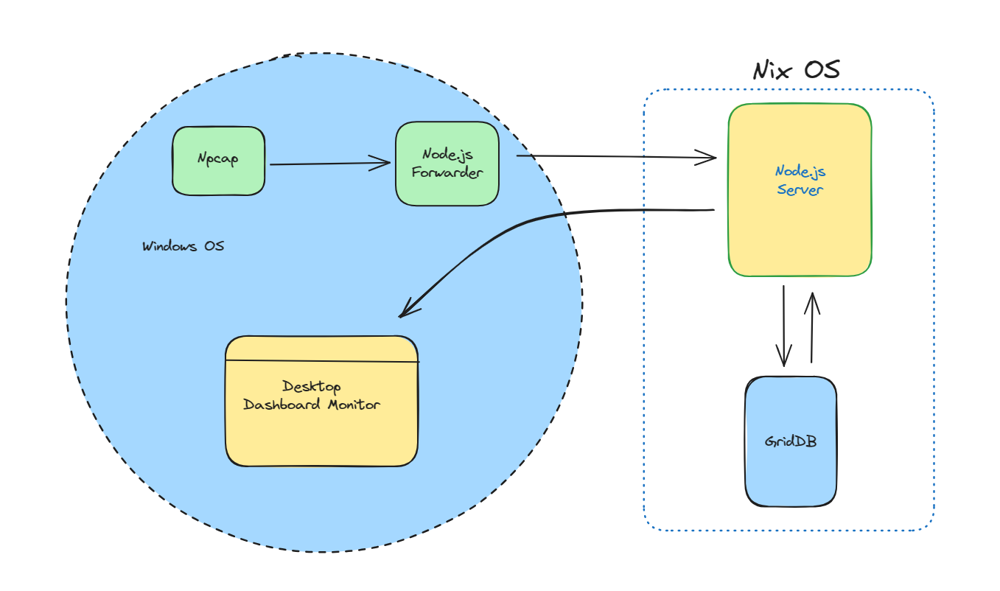

# Building a Desktop WiFi Network Monitor with Tauri, React, Node.js, and GridDB

## Introduction

In this article, we will delve into the process of constructing a Desktop WiFi Network Monitor, intricately weaving together technologies like **Node.js**, **Tauri**, and **React**. Central to our architectural decisions is the emphasis on using **GridDB** for our storage needs. But why GridDB? As we navigate through the intricacies of WiFi network monitoring, the choice of a reliable and efficient storage mechanism becomes paramount. GridDB, with its unique features and optimized performance characteristics, emerges as an ideal candidate. Paired with the versatility of Node.js, the rich user interface capabilities of React, and the cross-platform advantages of Tauri, we aim to present a holistic approach to effective network monitoring.

## System Architecture



Within the architecture of the Desktop WiFi Network Monitor, **Npcap** stands out as a powerful packet capture module optimized for Windows OS. This utility continuously fetches WiFi network packets, subsequently channeling them to our dedicated **Node.js Server**. Beyond mere data processing, this server integrates seamlessly with **GridDB**, our selected high-performance database. Once data is safely persisted, the server interfaces with an advanced dashboard developed using **Tauri** and **React**. This interface is designed to provide a detailed and actionable visualization of the network metrics directly on the user's desktop.

## Capture Network Traffic

Capturing network traffic using Node.js typically involves native modules that interface with system-level libraries like **libpcap** (on Unix-like systems) or **WinPcap/Npcap** (on Windows). For this post, we will be using Windows OS.

### Install Npcap

[Npcap](https://npcap.com/) is a packet capture and sending library for Microsoft Windows. We need to install this software first so that later we can use it with the node.js npm package, such as [`cap`](https://github.com/mscdex/cap), to perform packet capturing.

To download Npcap, please visit [their site](https://npcap.com/#download) and choose the appropriate installer type for a hassle-free installation. Upon installation, leave every option at its default.


## Backend Development with Node.js and GridDB

### Node.js

Node.js® is an open-source, cross-platform JavaScript runtime environment. Download the Windows installer from [here](https://nodejs.org/en/download). We will use the Node.js LTS v18.18.0 version. There many ways to install Node.js in Windows, please look into their [documentation](https://nodejs.dev/en/). We can use 3rd party Windows package installer such as [chocolatey](https://chocolatey.org/) or use the manual installation.

You can check the Node.js installation in the terminal with running this command:

```shell
node --version
```


- **Frontend Development with React**
  - Discuss the project structure, components, and integration with the backend.
- **Desktop Integration using Tauri**
  - Detail the process of turning your web app into a desktop application with Tauri.

## Demonstrating the Results

- Share performance results, user feedback, or any metrics that demonstrate the value of your solution.
- Visual aids: Use screenshots or GIFs of the application in action to reinforce the benefits.

## Addressing the Challenges

- Describe any obstacles faced during development.
- Detail how you overcame them, offering insights or best practices derived from your experiences.

## Conclusion

- Recap the main points of your post, combining the "why" and the "how".
- Discuss potential future enhancements or plans related to the project.

## Call to Action

- Invite readers to try out your project (provide a GitHub link if it's open source).
- Encourage comments, questions, and feedback.

## References/Further Reading

- List any sources you cited or further reading materials for those interested in diving deeper into specific technologies.
